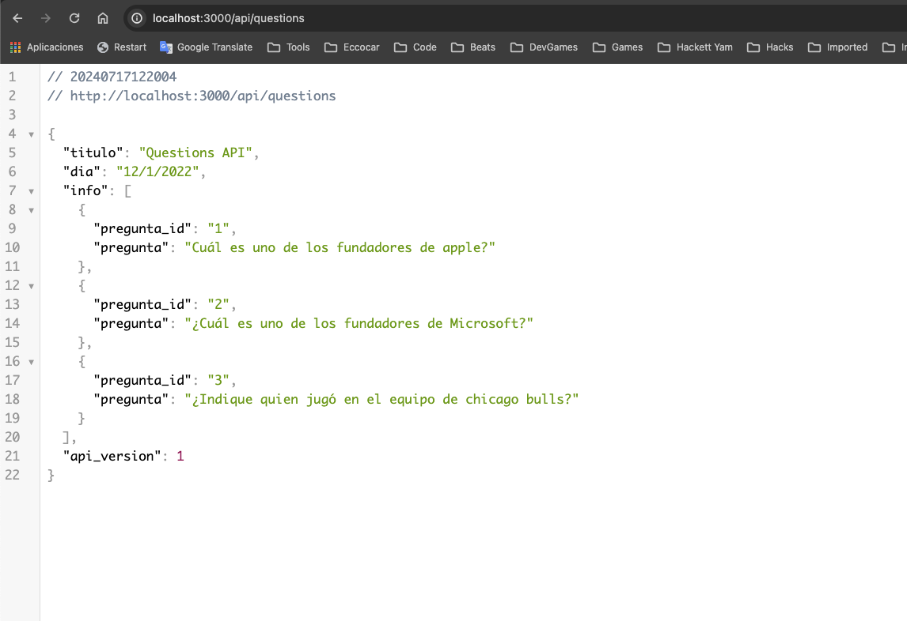

# Teamcore Questions API




## Demo

[https://teamcore-testapi.vercel.app/](https://teamcore-testapi.vercel.app/)

## Service Functionalities

- Fetch questions from an external API.
- Provide a new endpoint with reformatted JSON response.

## Architecture

This codebase follows the Hexa3 architecture, which is a combination of Hexagonal Architecture and Domain-Driven Design (DDD) principles. This architecture promotes a clean separation of concerns and a modular design, making the codebase more maintainable and scalable.

### Folder Structure

```bash
├── app -> (contains routes api)
├── domain
│   ├── constants -> (contains App constants)
├── infra
│   └── services -> (contains APIs services)
```

## API endpoints

- GET `/api/questions` -> Use for getting the questions list.

## Tech Stack

- [React](https://reactjs.dev/)
- [Next.js](https://nextjs.org/)
- [Eslint](https://eslint.org/)
- [Typescript](https://www.typescriptlang.org/)

## Additional Resources

- External API for questions data: [https://us-central1-teamcore-retail.cloudfunctions.net/test_mobile/api/questions](https://us-central1-teamcore-retail.cloudfunctions.net/test_mobile/api/questions)


## Run the app

First, install the dependencies:

```bash
npm install
```

Then, run the development server:

```bash
npm run dev
```

Open [http://localhost:3000](http://localhost:3000) with your browser to see the result.

> **Note**
> If you want to run the production server:
>
> ```bash
> npm run build
> ```
>
> And then open the production build in the browser:
>
> ```bash
> npm run start
> ```

## Deploy the app

Build and deploy the service to Google Cloud Run:

```bash
gcloud config set project [PROJECT_ID]
gcloud run deploy
```